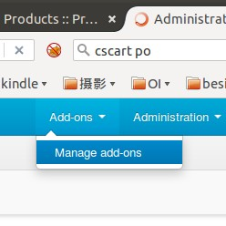
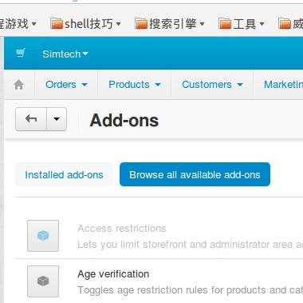
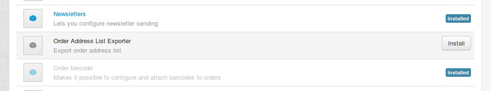
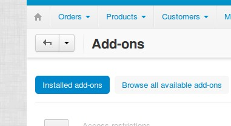
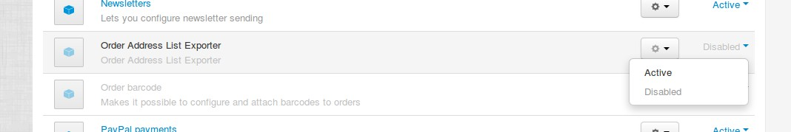
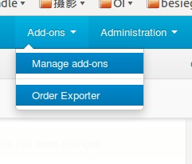
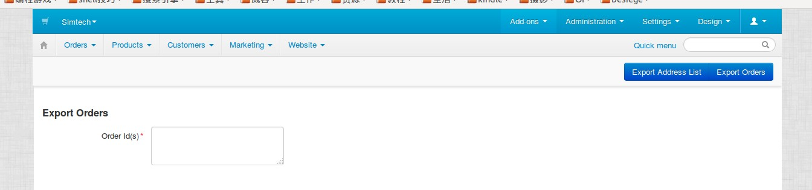

# cscart-order-address-list-exporter

## 安装

* 将本目录中所有文件放入cscart对应的目录中(images目录和README.md文件除外)
* 打开CS-Cart系统后台
* Add-ons -> Manage add-ons 打开系统插件管理



* Browse all available add-ons 查看所有可用的插件，如果文件都放置正确则会找到我们的插件



* Order Address List Exporter -> Install 安装插件



* Installed add-ons 由于插件安装后处于禁用状态，我们要回到浏览所有已安装插件来启用刚装好的插件



* Order Address List Exporter -> Active 启用插件



* Add-ons -> Order Exporter 打开导出页面，可以正常使用了



* 文本框填入要导出订单的ID，右侧Export Address List导出地址列表，Export Orders导出订单信息



## 使用

* 文本框填入要导出的订单ID，用逗号分割多个订单ID，支持95-102这类的批量订单ID写法
* 订单Address List使用csv格式导出
* 订单信息使用xslx格式导出，请使用Windows Office 2007及以上版本打开
